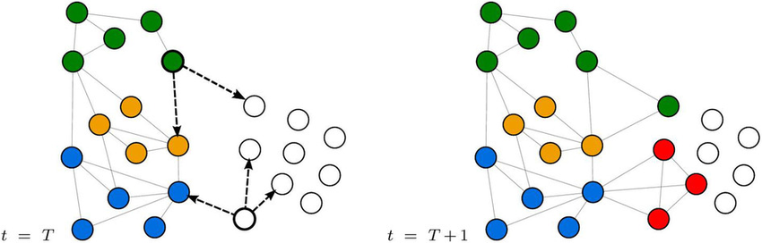

Label Propagation  [](https://arxiv.org/abs/0709.2938)
============================================
<p align="justify">
A NetworkX implementation of "Near Linear Time algorithm to Detect Community Structures in Large-Scale Networks" (Physical Review E 2008).
</p>
<p align="center">
  
</p>

### Abstract

<p align="justify">
Community detection and analysis is an important methodology for understanding the organization of various real-world networks and has applications in problems as diverse as consensus formation in social communities or the identification of functional modules in biochemical networks. Currently used algorithms that identify the community structures in large-scale real-world networks require a priori information such as the number and sizes of communities or are computationally expensive. In this paper we investigate a simple label propagation algorithm that uses the network structure alone as its guide and requires neither optimization of a pre-defined objective function nor prior information about the communities. In our algorithm every node is initialized with a unique label and at every step each node adopts the label that most of its neighbors currently have. In this iterative process densely connected groups of nodes form a consensus on a unique label to form communities. We validate the algorithm by applying it to networks whose community structures are known. We also demonstrate that the algorithm takes an almost linear time and hence it is computationally less expensive than what was possible so far. .</p>

The model is now also available in the package [Karate Club](https://github.com/benedekrozemberczki/karateclub).

This repository provides an implementation for Label Propagation as described in the paper:

> Near linear Time Algorithm to Detect Community Structures in Large-scale Networks.
> Usha Nandini Raghavan, Reka Albert, Soundar Kumara.
> Phyical Review E, 2008.
> [[Paper]](https://arxiv.org/abs/0709.2938)


### Requirements
The codebase is implemented in Python 3.5.2 | Anaconda 4.2.0 (64-bit). Package versions used for development are just below.
```
networkx          2.4
tqdm              4.28.1
numpy             1.15.4
pandas            0.23.4
jsonschema        2.6.0
python-louvain    0.11
texttable         0.15.0
```

### Datasets
<p align="justify">
The code takes an input graph in a csv file. Every row indicates an edge between two nodes separated by a comma. The first row is a header. Nodes should be indexed starting with 0. Sample graphs for the `Facebook Politicians` dataset is included in the  `data/` directory.</p>

### Options

Creating a clustering is handled by the `src/label_propagation.py` script which provides the following command line arguments.

#### Model options

```
  --input               STR    Input graph path.                          Default is `data/politician_edges.csv`.                                     
  --assignment-output   STR    Node-cluster assignment dictionary path.   Default is `output/politician.json`.
  --weighing            STR    Weighting strategy.                        Default is `overlap`.
  --rounds              INT    Number of iterations.                      Default is 30.
  --seed                INT    Initial seed           .                   Default is 42.
```

### Examples

The following commands create cluster assignments and writes them to disk.

Creating communities for the default dataset with the default hyperparameter settings.

```sh
$ python src/label_propagation.py
```
Using unit weighted label propagation.

```sh
$ python src/label_propagation.py --weighting unit
```

Changing the random seed.

```sh
$ python src/label_propagation.py --seed 32
```

Using label propagation with 100 iteration rounds.

```sh
$ python src/label_propagation.py --rounds 100
```
